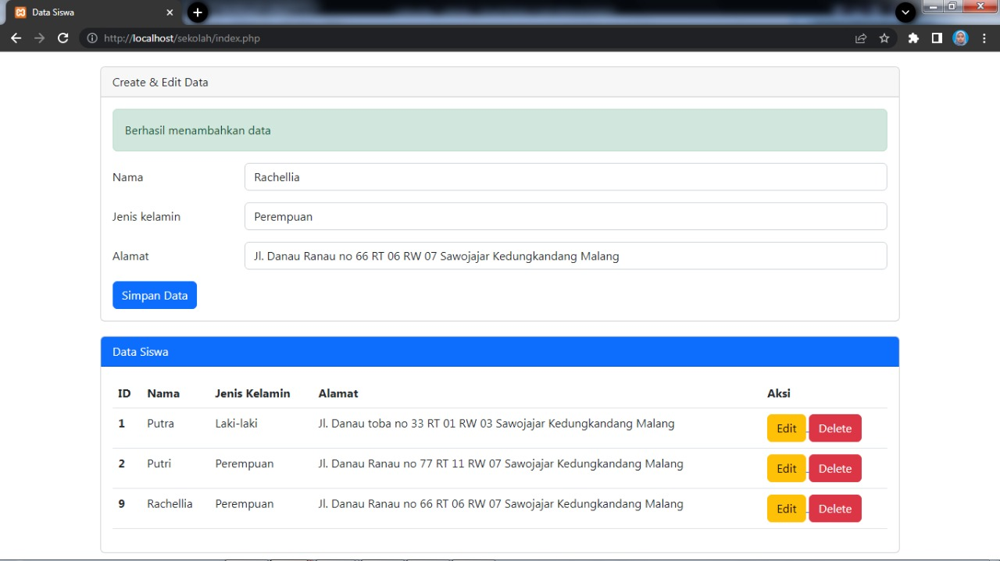
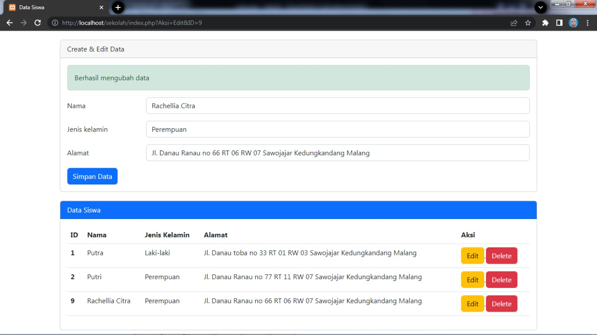
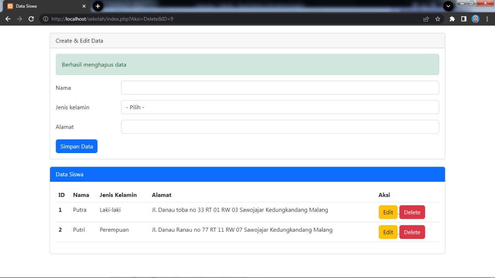
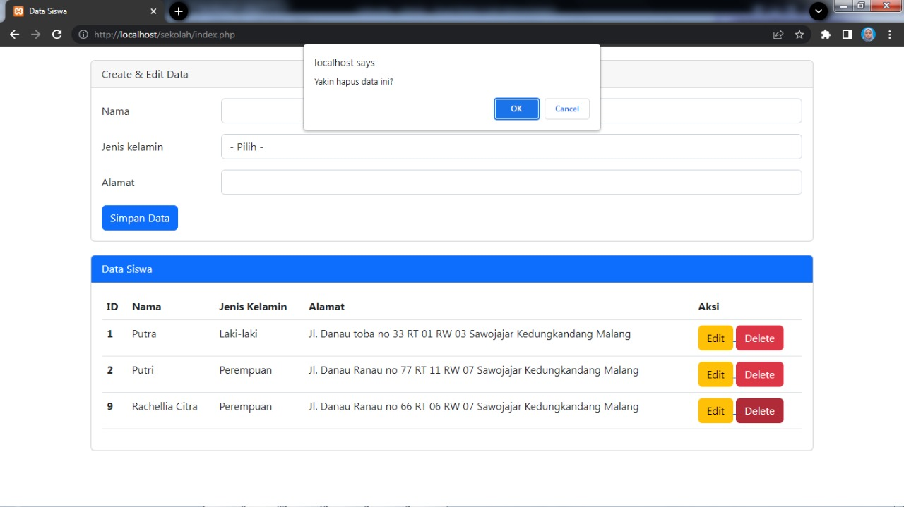

# Tes PKL
Menampilkan tabel siswa yang disertai dengan fitur menambah, mengubah, dan menghapus data.
### Database 

### Screenshot Hasil Tes
Read Data (Index):
  

  
Create Data:
  

  
Update Data:
  

  
Delete Data:
  

